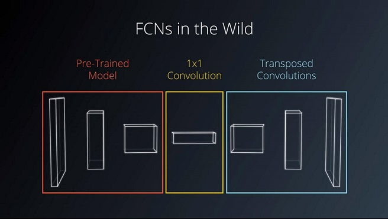
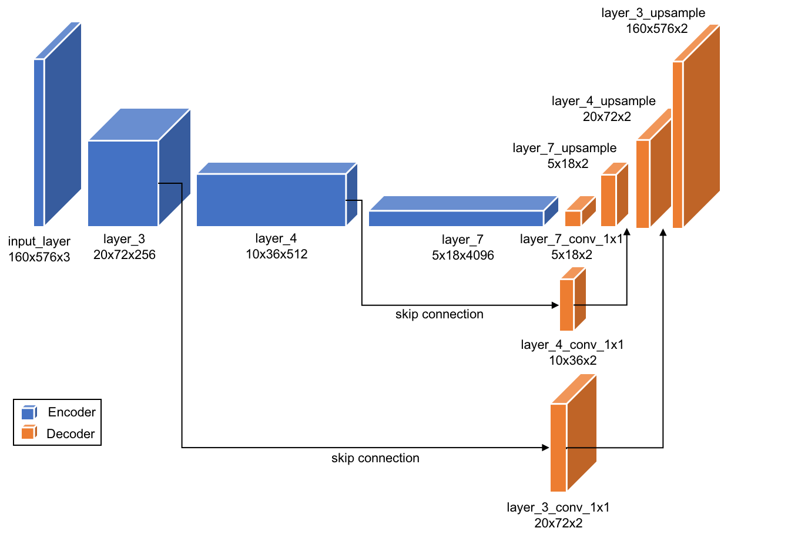

## Semantic Segmentation
### Introduction
In this project, we label the pixels of a road in images using a Fully Convolutional Network (FCN).

KITTI Road segmentation


## Fully Convolutional Network (FCN) Architecture

An FCN was used in this project because it retains the spatial information during training. 

The architecture used in this project is divided into three main parts as shown in the architecture below:



* The Fully Convolutional Network (FCN) is based on a pre-rained VGG-16 image classification network. The VGG-16 network acts as a encoder. 

* The 1x1 convolution reduces the number of filters from 4096 of VGG to the
number of classes for our segmentation model.

* The decoder is extracted from layer 3, 4, 7 of the VGG-16 model with transposed convolutions (upsampling) and skip connections.



- `layer_7_conv_1x1`: conv2d(kernel_size=1, strides=1)
- `layer_7_upsample`: conv2d_transpose(kernel_size=4, strides=2)
- `layer_4_conv_1x1`: conv2d(kernel_size=1, strides=1)
- `layer_4_upsample`: conv2d_transpose(kernel_size=4, strides=2)
- `layer_3_conv_1x1`: conv2d(kernel_size=1, strides=1)
- `layer_3_upsample`: conv2d_transpose(kernel_size=16,strides=8)


### Setup
##### GPU
`main.py` will check to make sure you are using GPU - if you don't have a GPU on your system, you can use AWS or another cloud computing platform.
##### Frameworks and Packages
Make sure you have the following is installed:
 - [Python 3](https://www.python.org/)
 - [TensorFlow](https://www.tensorflow.org/)
 - [NumPy](http://www.numpy.org/)
 - [SciPy](https://www.scipy.org/)
##### Dataset
Download the [Kitti Road dataset](http://www.cvlibs.net/datasets/kitti/eval_road.php) from [here](http://www.cvlibs.net/download.php?file=data_road.zip).  Extract the dataset in the `data` folder.  This will create the folder `data_road` with all the training a test images.

### Start
##### Implement
Implement the code in the `main.py` module indicated by the "TODO" comments.
The comments indicated with "OPTIONAL" tag are not required to complete.
##### Run
Run the following command to run the project:
```
python main.py
```
**Note** If running this in Jupyter Notebook system messages, such as those regarding test status, may appear in the terminal rather than the notebook.


### Tips
- The link for the frozen `VGG16` model is hardcoded into `helper.py`.  The model can be found [here](https://s3-us-west-1.amazonaws.com/udacity-selfdrivingcar/vgg.zip).
- The model is not vanilla `VGG16`, but a fully convolutional version, which already contains the 1x1 convolutions to replace the fully connected layers. Please see this [post](https://s3-us-west-1.amazonaws.com/udacity-selfdrivingcar/forum_archive/Semantic_Segmentation_advice.pdf) for more information.  A summary of additional points, follow. 
- The original FCN-8s was trained in stages. The authors later uploaded a version that was trained all at once to their GitHub repo.  The version in the GitHub repo has one important difference: The outputs of pooling layers 3 and 4 are scaled before they are fed into the 1x1 convolutions.  As a result, some students have found that the model learns much better with the scaling layers included. The model may not converge substantially faster, but may reach a higher IoU and accuracy. 
- When adding l2-regularization, setting a regularizer in the arguments of the `tf.layers` is not enough. Regularization loss terms must be manually added to your loss function. otherwise regularization is not implemented.
 

